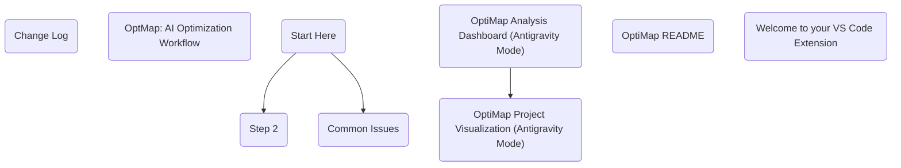
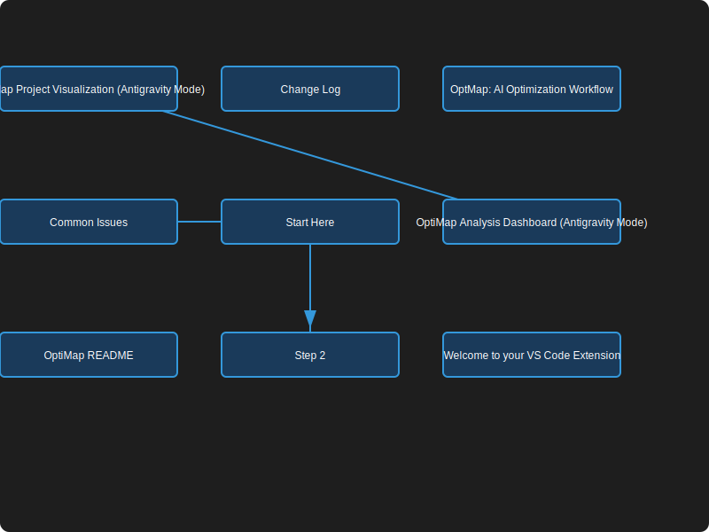

# OptiMap Project Visualization (Antigravity Mode)

Questa è la rappresentazione grafica reale del tuo progetto, generata automaticamente.

### 📊 Grafo Mermaid (Codice Sorgente)

### 🖼️ Anteprima Statica (SVG)

### 📊 Statistiche Analisi
- **Nodi Totali**: 9
- **Collegamenti**: 3
- **Cicli Rilevati**: 0
- **Ottimizzazioni Suggerite**: 0

---
*Ultimo aggiornamento: 02/04/2026, 13:08:26*