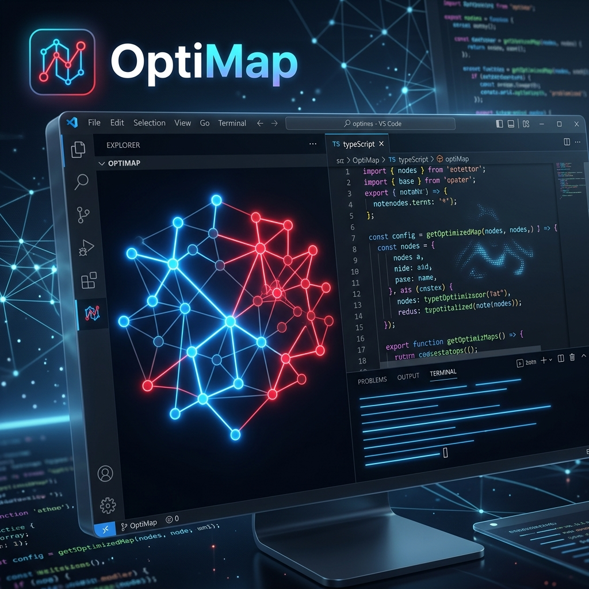

# OptiMap: AI Workflow Visualizer & Optimizer

**OptiMap** is a premium VS Code extension designed to bring clarity and efficiency to **AI Agent Workflows**. It analyzes your workspace (Workflows, Skills, and Documentation), generates an interactive graph, and identifies structural bottlenecks that slow down or confuse AI assistants.

---

## 🚀 Key Features

### 🗺️ Interactive Sidebar Dashboard
Visualize your entire AI strategy in a single glance. Our **D3.js-powered graph** allows you to explore node relationships, drag to reposition, and zoom into specific files.

### 🔍 Search & Focus
Forget hunting through folders. Use the built-in **Node Search** to instantly center the map on a specific file, or click an optimization card to **auto-zoom** into the source of a problem.

### 🔴 Intelligent Diagnostics (Loop Detection)
OptiMap automatically detects **Circular References (Loops)** and **Redundances** that can trap an AI agent in a "reasoning loop." These are highlighted in vibrant red with a gold border for immediate action.

### 🤖 AI-Powered Fixes
If you have AI agents integrated (`/agents` folder), OptiMap can **delegate fixes** directly to them. Simply click "Apply Fix" and let your agents handle the refactoring.

---

## 🎨 Visual Identity & Legend

To keep your workflow lean, we provide immediate visual feedback:
- 🔵 **Blue Nodes**: Healthy, well-linked workflow steps.
- 🔴 **Red Nodes**: Potential bottlenecks or detected errors.
- 🟡 **Search Highlight**: Temporary focus border when searching for a file.

---

## 📦 How to Get Started

1.  **Install** the extension in VS Code.
2.  **Open** the Sidebar via the OptiMap icon in the Activity Bar.
3.  **Scan**: Click the 🔄 button to analyze your `.agents/workflows` and `.agents/skills`.
4.  **Explore**: Drag nodes, search for files, and fix detected issues.

---

## 📄 Documentation & Policies

We believe in transparency and security:
- **[LICENSE](LICENSE)**: Open-source under the MIT License.
- **[SECURITY.md](SECURITY.md)**: Our commitment to safe analysis and vulnerability reporting.
- **[PRIVACY_POLICY.md](PRIVACY_POLICY.md)**: Your code stays local. We process everything on your machine.

---

## 🛠️ Testing Locally

1.  Clone the repository.
2.  Run `npm install` and `npm run compile`.
3.  Press `F5` to open the **Extension Development Host**.
4.  Run the command `OptiMap: Analyze AI Workflow Paths` to see the dashboard in action.

---

  <i>Optimize your AI, empower your project.</i>

